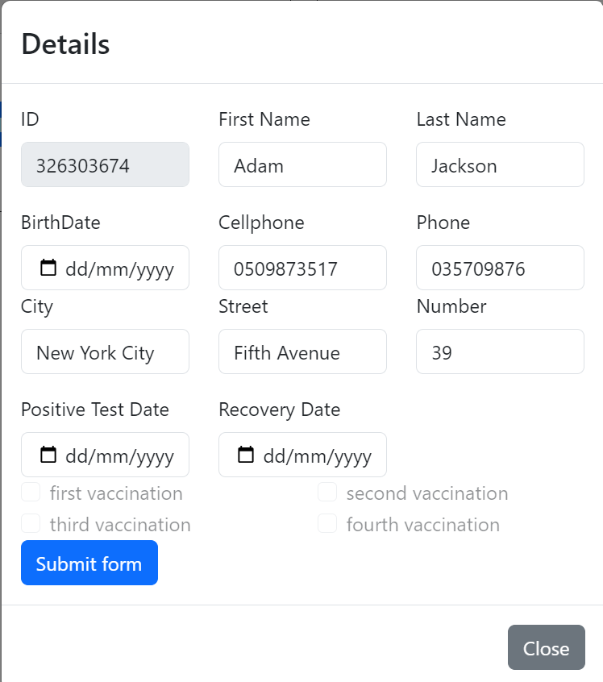

The Member Management System is a web application built using React that allows users to manage member information and their vaccination records. 
The system provides functionalities to add, edit, and delete members, as well as to add vaccinations to members' profiles.

Key Features:

1 - Member Management

  Add Member: Users can add new members to the system by providing their personal details such as name, birth date, contact information, and address.

  Edit Member: Existing member information can be edited, allowing users to update any changes in personal details or contact information.

  Delete Member: Members can be removed from the system, along with their associated vaccination records.

2 - Vaccination Management
  Add Vaccination: Users can record vaccinations for each member, specifying details such as the vaccination manufacturer. The system supports multiple vaccinations per member.
  View Vaccination History: Members' vaccination histories are displayed, showing the manufacturer and of each vaccination.

3 - User Interface
Modal Forms: User interactions such as adding or editing members are facilitated through modal forms, providing a seamless and intuitive user experience.

Prerequisites:

Node.js installed on your local machine
MongoDB or a compatible database server running locally or accessible via URL

Technologies Used:

React: Frontend JavaScript library for building user interfaces
React Bootstrap: UI framework for responsive web development
Axios: Promise-based HTTP client for making API requests
Formik: Form library for React applications
Yup: JavaScript schema builder for form validation

API Server:

The application expects a RESTful API server running locally or accessible via URL.
Ensure that the API server is correctly configured to handle requests for managing member and vaccination data.